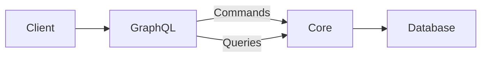

# GraphQL Adapter Implementation Guide

## Architecture Overview

Our GraphQL implementation follows **hexagonal architecture** with **CQRS** pattern:

- 🏗️ **Commands** (Write Operations): Handled in `mutations.rs`
- 🔍 **Queries** (Read Operations): Handled in `queries.rs`
- 📦 **Domain Models**: Centralized in `core/models`



## Directory Structure

```
graphql/
├── auth/              # Authentication operations
├── catalog/           # Catalog management
├── sales/             # Sales operations
├── common/            # Shared utilities
├── mutations.rs       # Root mutation definitions
├── queries.rs         # Root query definitions
└── mod.rs             # Schema configuration
```

## Implementation Patterns

### 1. Creating Mutations
```rust
// In domain module (e.g.: sales/customer_mutations.rs)
use juniper::FieldResult;

pub fn create_customer(
    input: CustomerNewInput,
    context: &AppState
) -> FieldResult<Customer> {
    let mut service = context.service.lock().unwrap();
    CustomerCommand { input }.exec(&mut service)
}

// In mutations.rs
#[graphql_object(context = AppState)]
impl Mutation {
    fn create_customer(input: CustomerNewInput, context: &AppState) -> FieldResult<Customer> {
        sales::customer_mutations::create_customer(input, context)
    }
}
```

### 2. Creating Queries
```rust
// In queries.rs
#[graphql_object(context = AppState)]
impl Query {
    fn items(
        &self,
        first: Option<i32>,
        offset: Option<i32>,
        context: &AppState
    ) -> FieldResult<Vec<Item>> {
        let mut service = context.service.lock().unwrap();

        let mut query = schema::items::table
            .order(schema::items::created_at.desc())
            .into_boxed();

        // Apply pagination
        if let Some(limit) = first {
            query = query.limit(limit as i64);
        }
        if let Some(off) = offset {
            query = query.offset(off as i64);
        }

        let results = query
            .select(Item::as_select())
            .load::<Item>(&mut service.conn)?;

        Ok(results)
    }
}
```

**Key Implementation Notes**:
1. **Direct Query Construction**:
   - Build queries directly using Diesel's query DSL
   - Chain methods for filtering/sorting
   ```rust
   let mut query = schema::items::table
       .filter(schema::items::name.ilike(format!("%{}%", search_term)))
       .into_boxed();
   ```

2. **Type-Safe Results**:
   - Use `as_select()` with domain models
   - Automatic deserialization into domain objects
   ```rust
   .select(Item::as_select())
   .load::<Item>()
   ```

3. **Pagination Support**:
   - Use `limit` and `offset` for pagination
   - Convert GraphQL parameters to SQL limits
   ```rust
   query = query.limit(first as i64).offset(offset as i64);
   ```

## Best Practices

1. **Type Safety**
- Strongly-typed IDs using `DbUuid`
- Validate inputs at GraphQL boundary
- Use domain-specific input/output types

2. **Pagination**
```rust
fn items(
    &self,
    first: Option<i32>,
    offset: Option<i32>,
    context: &AppState
) -> FieldResult<Vec<Item>> {
    /* pagination logic */
}
```

## Schema Evolution

1. Update `schema.rs` first
2. Generate migration files
3. Update domain models
4. Modify GraphQL adapters

## Example Usage

```graphql
mutation CreateItem {
  createItem(input: {
    name: "New Item",
    price: 9.99,
    categoryId: "uuid"
  }) {
    id
    name
    price
  }
}

query GetItems {
  items(first: 10) {
    id
    name
    price
    category {
      name
    }
  }
}
